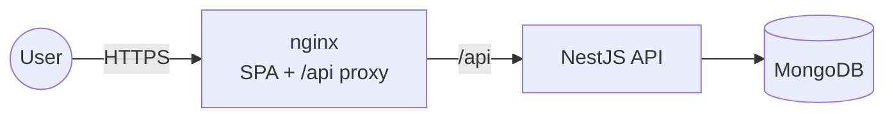
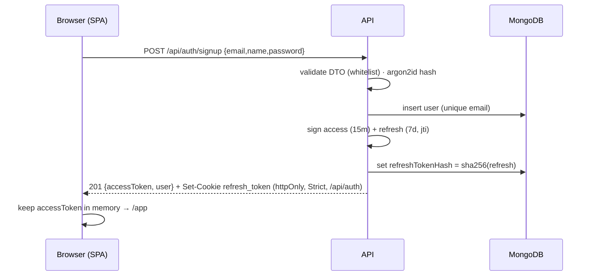
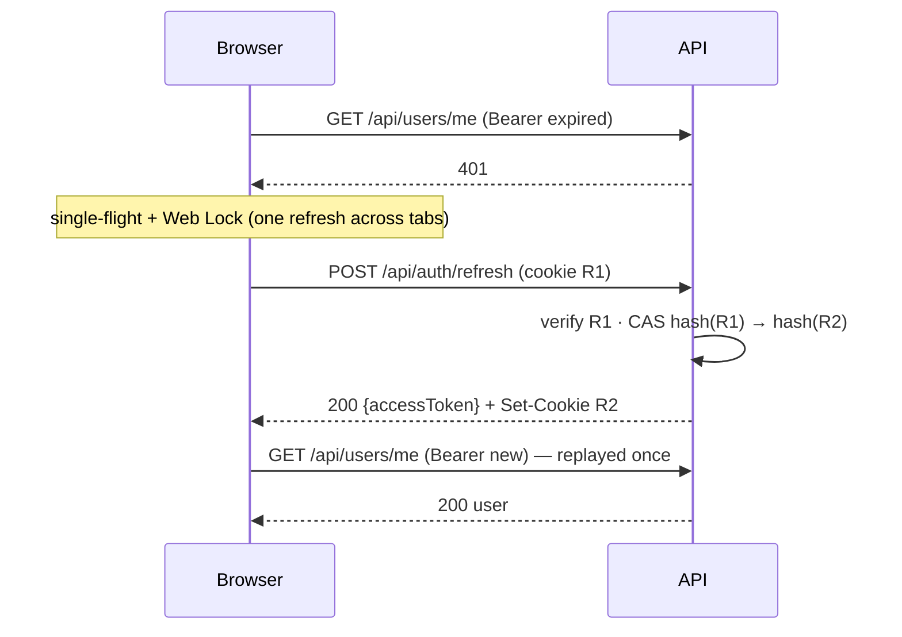

# Architecture

## System context



One origin for the browser ([ADR-0007](./adr/0007-same-origin-deployment.md)). nginx serves the
built SPA and proxies `/api/*` to the API. The API is stateless apart from MongoDB.

## Backend components

```
backend/src
├── main.ts                 bootstrap (top-level await), pino logger
├── app.module.ts           composition root: Config, Logger, Throttler, Persistence, Health, Users, Auth
├── app.setup.ts            HTTP config shared with e2e: prefix, helmet, cookies, CORS, ValidationPipe, filter, Swagger
├── config/                 Joi env schema + typed AppConfig
├── common/                 AllExceptionsFilter, ErrorResponseDto, auth rules, transforms, @IsStrongPassword
├── persistence/            PersistenceModule.forRoot(driver) → binds ports to adapters
├── modules/
│   ├── auth/               AuthController, AuthService, TokensService, PasswordHasher, JwtStrategy, JwtAuthGuard (global)
│   ├── users/              domain/, UsersRepository (port), infrastructure/{mongoose,in-memory}, UsersController
│   └── health/             terminus, per-driver indicators
└── scripts/export-openapi  writes specs/001-auth-module/contracts/openapi.json
```

Dependency rule: `controller → service → port ← adapter`. Nothing outside
`infrastructure/mongoose` imports Mongoose ([ADR-0004](./adr/0004-repository-port-and-adapters.md)).

## Frontend components

```
frontend/src
├── main.tsx, app/          providers (QueryClient, AuthProvider, Toaster) + route table
├── api/                    client.ts (apiFetch, refreshSession), session.ts (in-memory token), errors.ts, types.ts
├── features/auth/          schemas (zod), auth-context, routes/guards, components/, pages/
├── features/home/          application (welcome) page
└── components/ui/          button, input, label, form-field (shadcn-style, Radix)
```

## Flows

### Sign up / sign in



### Authenticated request with transparent refresh



### Reuse detection

If `R1` is presented after it was rotated, the compare-and-swap fails. The API then clears the
stored hash, so every session token for that user (including `R2`) stops working, and answers `401`.

## Cross-cutting concerns

| Concern          | Where                                                                         |
| ---------------- | ----------------------------------------------------------------------------- |
| Validation       | `ValidationPipe` (global) + DTOs. zod on the client                           |
| Errors           | `AllExceptionsFilter` → `{statusCode,error,message,path,timestamp,requestId}` |
| Logging          | nestjs-pino. `x-request-id` in/out. Redaction of auth headers and cookies     |
| Security headers | Helmet (API), nginx CSP (SPA)                                                 |
| Rate limiting    | `@nestjs/throttler` on `AuthController`                                       |
| Config           | `ConfigModule.validate` (Joi), typed `ConfigService<AppConfig, true>`         |
| API docs         | Swagger at `/api/docs`. Exported OpenAPI in `specs/001-auth-module/contracts` |
