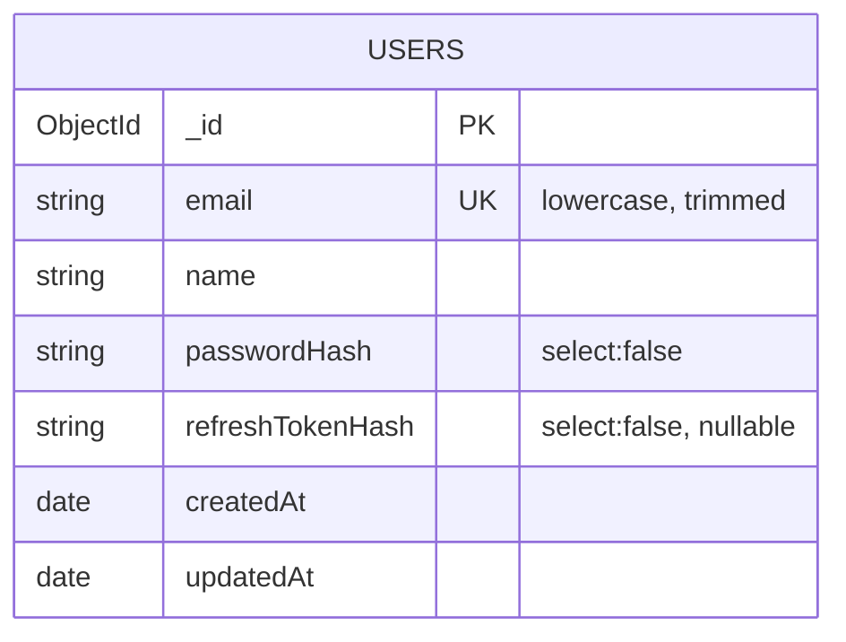
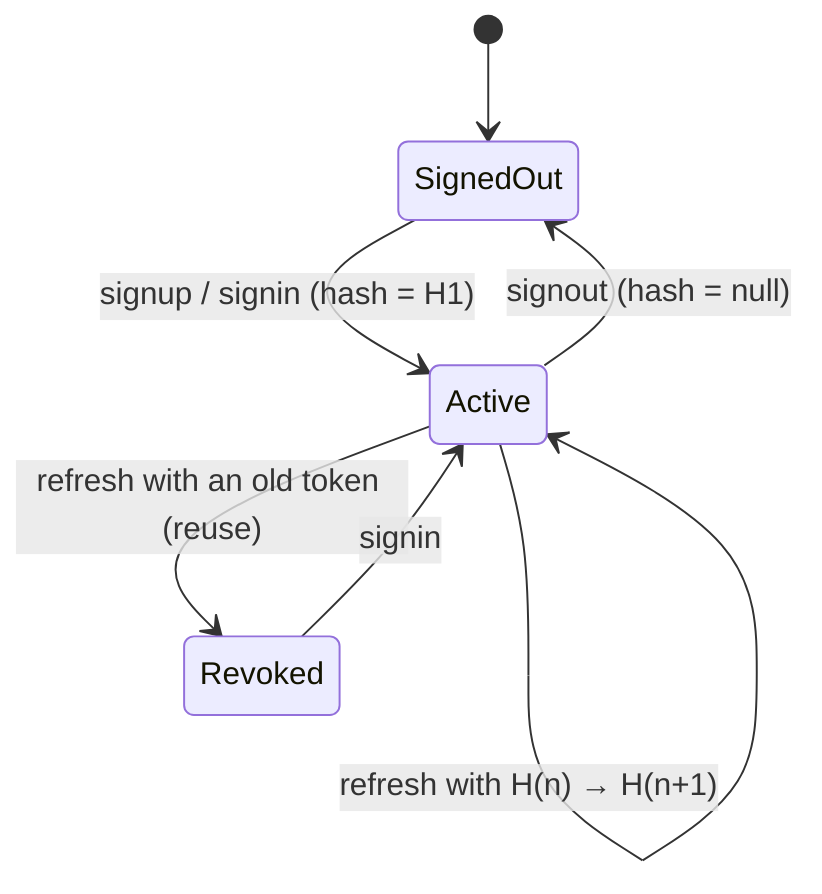

# Data model 001

## `users` collection

| Field              | Type           | Constraints                                 | Notes                                                                  |
| ------------------ | -------------- | ------------------------------------------- | ---------------------------------------------------------------------- |
| `_id`              | ObjectId       | PK                                          | Exposed as `id` (string)                                               |
| `email`            | string         | required, **unique index**, lowercase, trim | Normalised before every query                                          |
| `name`             | string         | required, trim, 3–50 chars (DTO)            |                                                                        |
| `passwordHash`     | string         | required, `select: false`                   | argon2id encoded string (`$argon2id$v=19$m=19456,t=2,p=1$…`)           |
| `refreshTokenHash` | string \| null | default `null`, `select: false`             | sha256 hex of the current refresh token. `null` = signed out / revoked |
| `createdAt`        | Date           | auto                                        | Mongoose `timestamps`                                                  |
| `updatedAt`        | Date           | auto                                        |                                                                        |



## Domain types (persistence-agnostic)

```ts
interface User {
  id;
  email;
  name;
  passwordHash;
  refreshTokenHash: string | null;
  createdAt;
  updatedAt;
}
interface PublicUser {
  id;
  email;
  name;
  createdAt;
} // the only shape that leaves the API
```

## Key operations (repository port)

| Operation                               | Mongo implementation                                                    | Guarantee                                              |
| --------------------------------------- | ----------------------------------------------------------------------- | ------------------------------------------------------ |
| `create`                                | `insertOne`. Duplicate key `11000` → `EmailAlreadyTakenError`           | Uniqueness enforced by the index, race-free            |
| `findByEmail`                           | `findOne({ email: { $eq } }).select('+passwordHash +refreshTokenHash')` | Operator injection impossible                          |
| `rotateRefreshTokenHash(id, old, new)`  | `updateOne({ _id, refreshTokenHash: old }, { $set: new })`              | Atomic compare-and-swap. Returns `false` on reuse/race |
| `setRefreshTokenHash(id, hash \| null)` | `updateOne`                                                             | Sign-in / revoke                                       |

## State: session lifecycle


