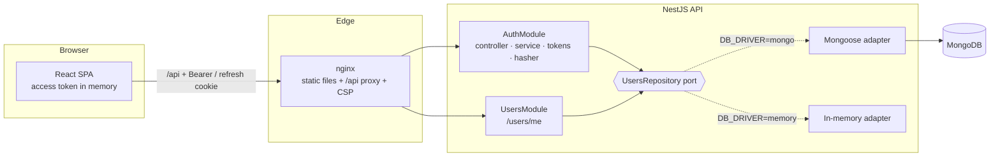

# Plan 001: Authentication module

|            |                      |
| ---------- | -------------------- |
| **Status** | Implemented          |
| **Spec**   | [spec.md](./spec.md) |

## 1. Summary

A NestJS 12 API with MongoDB issues a short-lived JWT access token (kept in memory by the SPA) and
a rotating, single-use refresh token (httpOnly cookie). A React 19 SPA provides the sign-up,
sign-in and application pages, with route guards and an API client that refreshes transparently.
Both sides validate the same rules. Everything ships with tests, Swagger, Docker and CI.

## 2. Constraints & assumptions

- The stack is mandated: React or Vue + TypeScript, NestJS + MongoDB.
- Delivery speed is scored, so prefer proven libraries and avoid custom infrastructure.
- Single-instance deployment for the assessment. Rate-limit storage is in-memory (switch to Redis when scaling out).
- The SPA and API are served from the same site ([ADR-0007](../../docs/adr/0007-same-origin-deployment.md)).

## 3. Architecture

Backend layering rules ([ADR-0004](../../docs/adr/0004-repository-port-and-adapters.md)):
controller (validate + shape) → service (use case) → repository **port** → adapter. Routes are
protected by default through a global `JwtAuthGuard`, and `@Public()` opts out.

Frontend: `features/auth` (schemas, context, guards, pages), `api/` (single fetch client),
`components/ui` (shadcn-style primitives). Server state uses TanStack Query.

## 4. Contracts

The full machine-readable contract is [contracts/openapi.json](./contracts/openapi.json),
generated from the code (`npm run openapi`) and checked for drift in CI.

| Method | Path                | Auth              | Success                             | Errors        |
| ------ | ------------------- | ----------------- | ----------------------------------- | ------------- |
| POST   | `/api/auth/signup`  | public, throttled | `201 AuthResponse` + cookie         | 400, 409, 429 |
| POST   | `/api/auth/signin`  | public, throttled | `200 AuthResponse` + cookie         | 400, 401, 429 |
| POST   | `/api/auth/refresh` | refresh cookie    | `200 AuthResponse` + rotated cookie | 401           |
| POST   | `/api/auth/signout` | refresh cookie    | `204`, cookie cleared               | —             |
| GET    | `/api/users/me`     | Bearer            | `200 User`                          | 401, 404      |
| GET    | `/api/health`       | public            | `200`                               | 503           |

UI routes: `/signup`, `/signin` (signed-out only), `/app` (signed-in only), `/` → `/app`, `*` → 404.

## 5. Data model

See [data-model.md](./data-model.md). One `users` collection with a unique email index. Secret
fields use `select: false`.

## 6. Security & privacy

| Threat                            | Control                                                                                    |
| --------------------------------- | ------------------------------------------------------------------------------------------ |
| Credential stuffing / brute force | Throttler 10 req/min/IP on `/auth/*`                                                       |
| Account enumeration               | Generic 401 message + dummy argon2 verify for unknown emails                               |
| Password DB leak                  | argon2id (19 MiB, t=2, p=1) ([ADR-0005](../../docs/adr/0005-argon2id-password-hashing.md)) |
| XSS token theft                   | Access token in memory only. Refresh token httpOnly                                        |
| CSRF                              | SameSite=Strict cookie, `Path=/api/auth`. API auth via the Authorization header            |
| Refresh token theft               | Single-use rotation + reuse detection (revokes the session). Only sha256 stored            |
| Mass assignment / NoSQL injection | `whitelist` + `forbidNonWhitelisted`, typed DTOs, `$eq`                                    |
| Info leakage                      | Uniform error shape, generic 500, log redaction                                            |

Full threat model: [docs/security.md](../../docs/security.md).

## 7. Test strategy

| Layer             | What                                                                                         | Where                                                |
| ----------------- | -------------------------------------------------------------------------------------------- | ---------------------------------------------------- |
| Unit (API)        | password rules, argon2 hasher, auth service (rotation, reuse, enumeration), error filter     | `backend/src/**/*.spec.ts` (Vitest)                  |
| E2E (API)         | every AC over real HTTP with production `configureApp`; in-memory **and** real MongoDB in CI | `backend/test/auth.e2e-spec.ts` (Vitest + Supertest) |
| Unit (web)        | zod schemas, API client refresh/replay/single-flight                                         | `frontend/src/**/*.test.ts`                          |
| Integration (web) | full flows through router + providers with a fetch fake                                      | `frontend/src/features/auth/auth-flow.test.tsx`      |
| Manual / smoke    | headless browser run of the full journey + mobile viewport                                   | documented in [tasks.md](./tasks.md) T040            |

## 8. Rollout & operations

- Config via env, validated by Joi at boot. Template in `backend/.env.example`.
- `docker compose up --build` runs mongo, the API and nginx + SPA. Health check: `/api/health`.
- Operations guide: [docs/runbook.md](../../docs/runbook.md). Deployment: [docs/deployment.md](../../docs/deployment.md).

## 9. Risks & mitigations

| Risk                                                    | Likelihood | Impact | Mitigation                                                                                       |
| ------------------------------------------------------- | ---------- | ------ | ------------------------------------------------------------------------------------------------ |
| Refresh race logs users out (StrictMode, multiple tabs) | High       | High   | Single-flight + Web Locks on the client, compare-and-swap on the server                          |
| Rules drift between client and server                   | Medium     | Medium | One rules file per side, cross-referenced, tested on both sides                                  |
| No MongoDB in the dev sandbox                           | High       | Medium | In-memory adapter behind the port. CI runs e2e against real MongoDB                              |
| Bleeding-edge NestJS 12 (ESM-only) tooling gaps         | Medium     | Medium | Follow the official ESM starter (Vitest). See [spec 002](../002-nestjs-12-esm-migration/spec.md) |

## 10. Implementation phases

1. **Foundation**: repo layout, configs, env validation, logging, error filter.
2. **Persistence**: domain types, repository port, Mongoose + in-memory adapters.
3. **Auth API**: DTOs, hasher, tokens, service, controller, guard, `/users/me`, health, Swagger.
4. **API tests**: unit + e2e.
5. **Frontend**: tokens/UI primitives, API client, auth context + guards, pages.
6. **Frontend tests**.
7. **Delivery**: Docker, nginx, CI, docs, AI.md.
